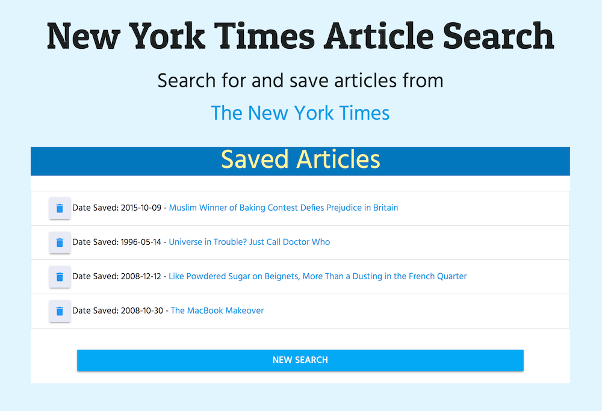

# ReactJS-NYT-Search

(React.js, Node.js, Express.js, MongoDB, Materialize, Axios) Makes calls to the New York Times API and generates sub-components for results. Has a feature to save articles to and delete from MongoDB.

React is no joke. This was one of my trickiest assignments ever, but I learned a TON, including using React Router, passing props (including props for setting the parent state), generating an array of components, getting components to update, and other various routing battles. I found making a full-stack React app to be very brain-bendy, a little bit like assembling Ikea furniture, hah. But it was stimulating trying to research and understand what was going on and getting familiarized with React's API and error messages.

[Heroku link](https://infinite-oasis-88386.herokuapp.com)